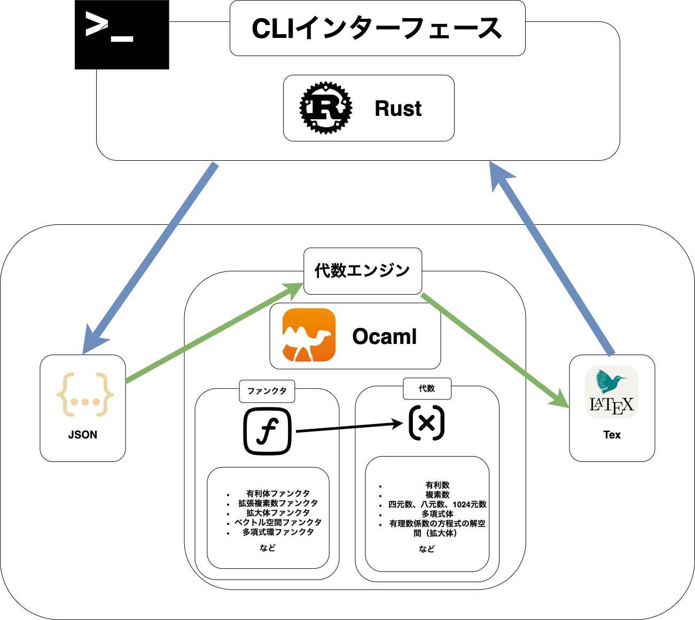

<p align="center"><h1 align="center">algebra</h1></p>
<p align="center">
	汎用代数エンジン
</p>
<p align="center">
	<a href="./LICENSE">
    
</a>

</p>
<br>

## Contents

- [Overview](#overview)
- [Features](#features)
- [Getting Started](#getting-started)
  - [Prerequisites](#prerequisites)
  - [Installation](#installation)
  - [Usage](#usage)
- [Project Structure](#project-structure)
- [API Endpoints](#api-endpoints)
- [Database Schema](#database-schema)
- [Testing](#testing)
- [Technologies](#technologies)
- [License](#license)
- [Contact](#contact)

---


## Overview

`Camagru` は、ユーザーがウェブカメラを使用して画像をキャプチャし、オーバーレイを配置して編集できるウェブアプリケーション。編集した画像をギャラリーで公開し、他のユーザーが閲覧、コメント、いいねができる。

## Architecture


---

## Features

-   **User Authentication**:
    - mail and password
    - google
    - github
-   **Image Editing**:
    -   ウェブカメラから画像をキャプチャする。
    -   画像をアップロードする。
    -   プリセットされたオーバーレイ（ステッカーなど）を画像に適用する。
    -   適用したオーバーレイの位置、サイズを調整する。
-   **Gallery**:
    -   編集した画像を公開ギャラリーに投稿する。
    -   すべての公開された画像を閲覧する。
    -   画像にコメントする、いいねする。
    -   コメントをいいねする。
-   **User Profile**:
    -   ユーザー名、メールアドレス、パスワードを変更
    -   コメント通知のオン/オフを設定
-   **Email Notifications**: 自分の投稿に新しいコメントがあった場合に通知メールを受け取る。

---

## Getting Started

### Prerequisites
-   **docker** () 
-   **docker compose** ()
-   **GNU make** ()

### Installation

1.  リポジトリをクローンする:
    ```sh
    git clone https://github.com/icchon/camagru.git
    cd camagru
    ```

2.  `.env` ファイルを設定する:
    `.env.example` をコピーして `.env` ファイルを作成し、環境変数を適切に設定する。
    ```sh
    cp .env.example .env
    # .env ファイルを開き、必要な環境変数を設定する
    ```

    主要な環境変数の説明:
    -   `POSTGRES_USER`, `POSTGRES_PASSWORD`, `POSTGRES_DB`: PostgreSQLデータベースの認証情報。
    -   `SMTP_HOST`, `SMTP_PORT`, `SMTP_SENDER_EMAIL`, `SMTP_SENDER_PASSWORD`: メール送信用のSMTPサーバー設定。
    -   `CAMAGRU_JWT_SECRET`: JWTの署名に使用する秘密鍵（任意の文字列）。
    -   `SERVER_DOMAIN`: APIサーバーのドメイン（例: `http://localhost:8080`）。
    -   `FRONTEND_DOMAIN`: フロントエンドアプリケーションのドメイン（例: `http://localhost:8080`）。
    -   `LOCAL_STORAGE_ROOT`: 画像保存に使用するローカルストレージのルートパス（例: `./static`）。
    -   `GOOGLE_CLIENT_ID`, `GOOGLE_CLIENT_SECRET`, `GOOGLE_REDIRECT_URI`: Google OAuth2の認証情報。
    -   `GITHUB_CLIENT_ID`, `GITHUB_CLIENT_SECRET`, `GITHUB_REDIRECT_URI`: GitHub OAuth2の認証情報。

3.  犬の画像をダウンロードする（オプション、ギャラリーの初期データ用）:
    ```sh
    make images
    ```

4.  Docker Composeでサービスを起動する:
    ```sh
    docker-compose up -d
    ```

### Usage

アプリケーションが起動したら、ブラウザで `http://localhost:8080` にアクセスする。

-   **API ドキュメント**: API の詳細については `docs/` ディレクトリを参照する。
-   **データベース管理**: `http://localhost:8081` でAdminerにアクセスできる。
    -   システム: PostgreSQL
    -   サーバー: db (docker-compose.ymlで定義されたサービス名)
    -   ユーザー名: `.env` で設定した `POSTGRES_USER`
    -   パスワード: `.env` で設定した `POSTGRES_PASSWORD`
    -   データベース: `.env` で設定した `POSTGRES_DB`
---

## Database Schema

schemaの詳細はdb/tbls参照


---

## Testing

Goバックエンドのユニットテストは以下のコマンドで実行できる。

```sh
make test-unit
```

DB依存のインフラ層テストは以下のコマンドで実行できる。

```sh
make test-infra
```
---

## License

This project is licensed under the MIT License - see the [LICENSE](./LICENSE) file for details.

© 2025 icchon